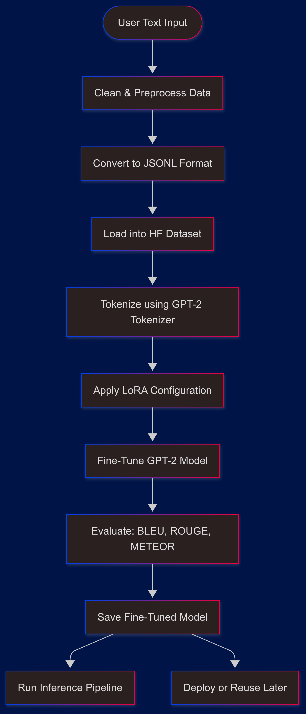

# 🤖 LoRA Fine-Tuning with GPT-2 for Emotion Classification

This project fine-tunes a GPT-2 model using **LoRA (Low-Rank Adaptation)** for **emotion classification**, enabling efficient training with fewer parameters. It uses the Hugging Face Transformers and PEFT libraries, and evaluates the model using BLEU, ROUGE, and METEOR metrics.

---

## 📌 Features

- ✅ Fine-tunes GPT-2 using LoRA for reduced compute and memory usage  
- 🧠 Emotion classification from user text inputs  
- 🧹 Cleans and converts dataset into JSONL format for instruction-tuned training  
- 📉 Evaluates performance using BLEU, ROUGE, and METEOR  
- 💾 Saves fine-tuned model for inference or future use  

---

## 💡 Use Cases

This fine-tuned model can be applied in the following scenarios:

- **Customer Support** – Detects emotional tone in messages to improve service response and escalation.  
- **Chatbots** – Enables emotion-aware virtual assistants that adapt tone and replies.  
- **Mental Health Applications** – Monitors user sentiment in journals or messages for emotional well-being tracking.  
- **Social Media Analysis** – Identifies emotion trends in tweets, posts, and reviews for brand or public sentiment.  
- **EdTech and HR Platforms** – Analyzes feedback and engagement sentiment to enhance learning or workplace experience.

---

## 📈 Fine-Tuning Workflow




## 🛠️ Setup

### 1. Clone the Repository

```bash
git clone https://github.com/SyamSundarAkina/Fine_Tuning_our_own_dataset.git
cd Fine_Tuning_our_own_dataset
